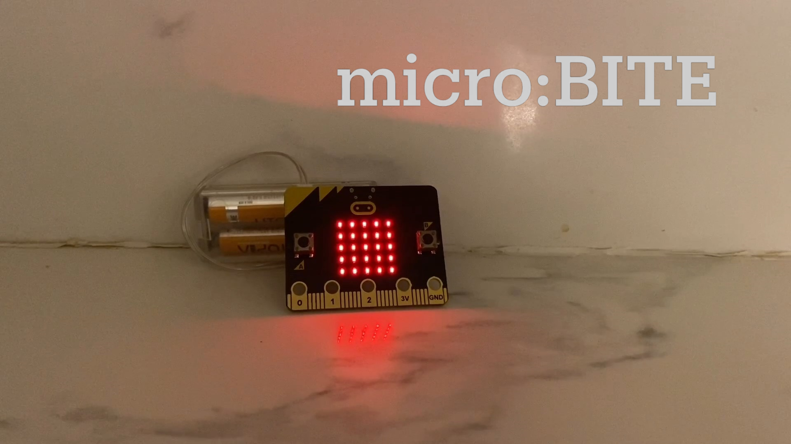

# micro:BITE (Awarded Runner-Up for North America in do your :bit Challenge)

## Trailer:

(click on the image to open the YouTube link)
## Description 
The micro:BITE is a product designed to remind users to consume food they have bought before it expires. The user simply needs to input the expiration date of their food, at which point the micro:bit will begin a countdown and create a time graph with alerts to remind the user how long they have until the food expires. The micro:BITE aims to reduce food waste and the associated negative effects that come with it. One of the top reasons why people waste food is because they are unaware of how much they actually waste. The micro:BITE will address this problem at the household consumer level, where the majority of food is thrown away. The micro:BITE therefore tackles the UN goal of “Responsible Food and Consumption”. This also ties into other UN goals because it affects things like climate action, good health and well being, and zero hunger. The micro:BITE does not need any extensions or additional data to fulfill the intended function, as it works solely based on a single micro:bit system, making it more efficient and cost-effective. (For the purposes of testing, the micro:BITE has two different versions: one with seconds and one with days, use the one with seconds to see how the micro:BITE would work if the days were replaced by seconds).

## The Bigger Picture:
Every year, over $400 billion in food is lost worldwide and around 931 million tons of food goes to waste, 61% of which comes from households. While food waste contributes to multiple global problems, it also causes individual consumers to lose out on a lot of unnecessary money. The micro:BITE will reduce the time, money, and energy spent by individuals and families on excessive food that goes to waste in their fridge. It will also help achieve the long term goals of reducing food waste, pollution, malnutrition, and unequal distribution of food. While the micro:BITE is a product designed for household consumers in North America, it can also be implemented globally and utilized by companies and grocery stores to ensure the food they are selling has not expired and the proper health standards are met. Food waste is an incredibly important problem that is currently affecting millions of people around the world, and the UN’s goal of reducing food waste in half by 2030 is quickly approaching. With our micro:BITE product, we will help tackle this problem at the consumer level, using a small solution to create a large impact that will improve the lives of communities around the world.

## How it Works:
To use the micro:BITE, the user must first set the time until the food expires by clicking Button A for each day that remains before expiration. For instance, if a box of strawberries expires in 10 days, the user clicks Button A on the micro:bit 10 times. Once satisfied, the user clicks Button B to confirm the time limit. This initiates the micro:BITE’s countdown process. The micro:BITE then completely lights up with LEDs. A row of LEDs turns off when a fifth of the time has gone by. For example, a fifth of 10 days is 2 days, so the micro:BITE turns off a row of LEDs every 2 days. This helps the user visualize the time being passed. Near the halfway mark, the micro:BITE beeps to remind the user to consume the food they have bought. If the user finishes consuming the food at any point after the time is confirmed, Button A+B can be clicked. The micro:BITE then lights up with a checkmark and plays a happy melody. Button B is pressed to reset. If the user has not consumed their food by the end of the time set, the micro:BITE will beep and display the message “EXPIRED.”

## Using it with a micro:bit:
Download the hex file directly onto the micro:bit, from there the micro:bit will automatically recognize the hex file and proceed to start the program if connected to a power source.

## Using the micro:BITE online:
To use the micro:BITE that utilises seconds instead of days to visualize the micro:BITE experience, click [here](https://makecode.microbit.org/08370-47657-85155-18962) and go on simulator to use the program.
